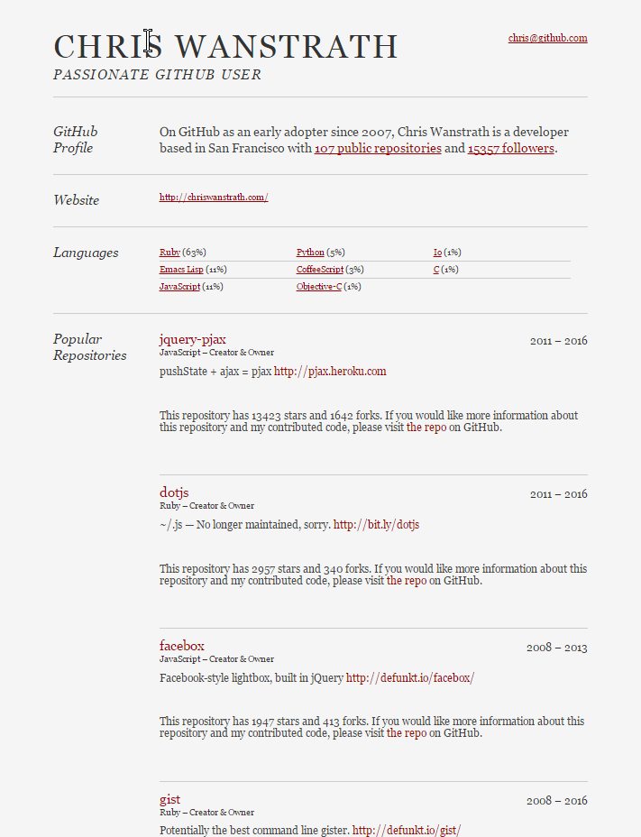

# GitHub CVs

## Intro

You think it's hard to find a good job. Have you tried finding a good developer? It's way harder.
Out of 10 CVs recruiter receives only one or two are worth having an interview with. And it takes 15-20 interviews
to finally select a suitable (in terms of experience, personality, budget) candidate. Who may just turn around
and select another offer.

From experiencing such situation came an idea. What if there was a standard way of obtaining a CV of any developer
and other way around - a way to check more details of the candidate, a way to learn more about this person. Of course
you can google it, but there must be a better way.

GitHub is a great for multiple reasons. Many developers have projects on GitHub - we could look at the GitHub profile
of a candidate and get some understanding of:

* technologies he uses
* number of projects he's working on
* how active is he on the projects
* etc.

Turns out there's a project like this already. [https://resume.github.io/](https://resume.github.io/) generates a
resume for every GitHub user (permission required). It looks pretty nice.

The problem with this approach is that it's 100% generated from the GitHub information. I believe most people would
prefer to write some text about themselves first and back this information up with evidence from their GitHub profile.

## GitHub hosted CV

My suggestion is to allow developers to write their CV in markdown syntax - just the way they write comments on GitHub.
And then also display the information about this person generated from the GitHub profile on the same CV.

Let's define a standard repository name for CVs - we call them "cv". This repository should contain
a CV of the developer in text form in a file called "me.md". Then there should be a tool for looking at this CV
and the auto-generated profile information. "http://resu.me/profile-name/" would have been a cool name, but it's
not available. Let's use "http://github-cv.me/profile-name/".

### Benefits for developers:

* Edit your CV with all the tools you already use to edit source code
* In a format familiar to you (Markdown)
* Keep the history of the changes (it's on GitHub)
* Prove your experience by your GitHub profile
* Feel free to write additional information

### Benefits for recruiters

* Get the latest version of the CV of the applicant (always up to date)
* Check the experience matches data collected from a GitHub profile
* At a glance - no need to search for information manually

## Example

Here's [my CV](cv.md) as an example. Feel free to fork and modify it for yourself.

## Alternatives

* [Seeveeze](https://www.seeveeze.com/de/). The professional CV editor.
* [Appolo Resume](https://apollo-resume.co/). Create impressive resumes.
* [Responsive CV](https://responsivecv.com/linkedin-resume-builder-online-free/). We help you make awesome first impression
with mobile resume along with free online CV.
* [re:Scan Chrome Ext.](https://chrome.google.com/webstore/detail/rescan/fjiopcojjjafjnfgipombdbpjimignpl?hl=en). A Chrome extension that provides a detailed report on how well-tailored an applicant's resume is to a particular job description.

## Idea #2

Having resume online is not something special these days. Unfortunately, applying for a job position still often requires to retype the information from your resume to different websites manually.

In order to ease applying we can build a browser plugin which will fetch your resume from various resume sites. After that the plugin will help you to fill your resume data semi-automatically into various job sites.

### Market Research

Quick googling for "fill your cv with one click" leads to:

* [http://www.snagajob.com/resources/find-your-next-job-in-just-1-click/]()
Applying to jobs can sometimes take awhile. You have to put in all your information over and over again – contact info, experience, education, availability, references, etc. This can be especially tough if you’re filling out applications on your phone or tablet.
But, we’re changing the way you apply to jobs. You’ll start to notice more and more “1-Click Apply” jobs when looking at job postings on Snagajob.

*Not sure - what's so special? Every job board in the world has one click apply to the jobs on **their** site. We want to be able to apply to jobs on any site.*

* [https://www.roboform.com/resume-submission]()
Use RoboForm to Fill Job Application Forms
RoboForm is the perfect tool to make your job search more productive, allowing you to apply to more jobs due to the time savings of one-click form filling. RoboForm is a great time saver as it lets you automatically log in various job sites, and fill out multiple job applications without typing anything.
Fill long forms with One Click.
When you encounter a page that contains a company's job application form, RoboForm will offer to fill the information. All of your application information such as name, address, work history, education, etc is stored encrypted in your RoboForm Identity.

*This is just a fill-anything software not specific to resumes. Without understanding that the filled-in information is a resume it may not be very good at it. And it's a binary application - requiring installation.*

## Step 1. Retrieving resumes

We don't want user to type their resume again even on our own site/plugin. We want to retrieve resumes from other sources. For example:

* [Linked-in](https://linkedin.com/) profile
* Resume sites like [resume.io](http://resume.io/) and [dozens of others](https://www.google.com/search?q=resume+online).
* [jsonresume.org](https://jsonresume.org/) is a little different. It provides all the information from the resume in a json format - easy to read for machines.
* [h-resume microformat](http://microformats.org/wiki/h-resume) is another standard way of retrieving resume information from HTML pages. Not sure how many sites generate resumes in this format.
* [Xing profile](https://xing.de/)

### Step 1.1

Reading Linked-in profile can be done with [linkedin-scraper2](https://www.npmjs.com/package/linkedin-scraper2)

Linked-in [forbids any scraping](https://www.linkedin.com/help/linkedin/answer/56347) of their data.

They have different markup for authenticated users. Some npm modules are working with public profile, some with detailed.

#### Public (not interesting)

* https://www.npmjs.com/package/linkedin-scraper2
* https://www.npmjs.com/package/linkedin-public-profile
* https://www.npmjs.com/package/linkedin-profiler (CLI, not working)
* https://www.npmjs.com/package/linkedin-profile
* https://www.npmjs.com/package/linkedin-public-profile-parser
* https://www.npmjs.com/package/in-scrape

#### Private view on profile

* https://www.npmjs.com/package/scrape-linkedin

#### Linked-in API

We would gladly use API but there is no API to retrieve any detailed profile information.

[This example](https://apigee.com/console/linkedin?req=%7B%22resource%22%3A%22%2Fpeople%2F~%3Fformat%3Djson-get%22%2C%22params%22%3A%7B%22query%22%3A%7B%22format%22%3A%22json%22%2C%22parameters_name_1%22%3A%22format%22%2C%22parameters_value_1%22%3A%22json-get%22%7D%2C%22template%22%3A%7B%7D%2C%22headers%22%3A%7B%7D%2C%22body%22%3A%7B%22attachmentFormat%22%3A%22mime%22%2C%22attachmentContentDisposition%22%3A%22form-data%22%7D%7D%2C%22verb%22%3A%22get%22%7D) retrieves only this.

<pre>
{
  "firstName": "asd",
  "headline": "Internet Professional",
  "id": "Ym93oekCnz",
  "lastName": "qwe",
  "siteStandardProfileRequest": {
    "url": "https://www.linkedin.com/profile/view?id=..."
  }
}

